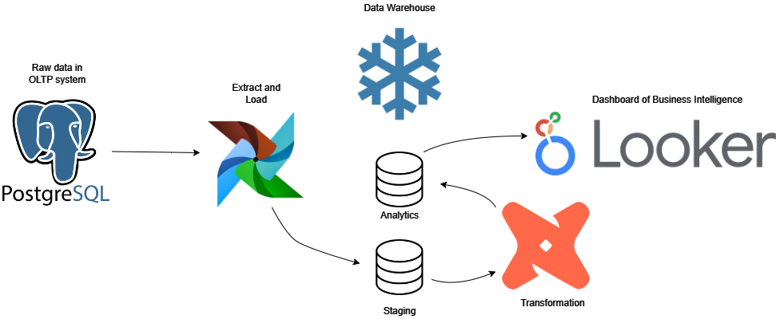

# Projeto de Data Warehouse com Snowflake, DBT, Airflow, PostGreSQL & Looker Studio

Em tal projeto, modelo um **Data Warehouse** no **Snowflake** para às análises de negócio da concessionária fictícia **NovaDrive Motors**, uso o **Apache Airflow** para estruturar uma **DAG** em **Python** que extrai incrementalmente os dados brutos da concessionária do banco de dados transacional **PostGreSQL** e os carrega na camada intermediária (**Staging**) do **DWH**, com o **DBT**, transformo e trato tais dados brutos em análises que são disponibilizadas na camada analítica do **DWH** para compor o **dashboard** de **BI (Business Intelligence)** no **Looker Studio** para analisar às vendas de tal concessionária.

Basicamente, na primeira fase do projeto, tive que extrair os dados brutos do banco de dados transacional **PostGreSQL** de tais tabelas **vendas**, **vendedores**, **veiculos**, **estados**, **cidades**, **clientes** e **concessionarias** do banco de dados da **NovaDrive Motors**:

https://github.com/jv-mendes07/elt_data_warehouse_snowflake/assets/93790271/1dbe6d29-b19a-41ea-86ce-92fee3212284

Para realizar tal extração de dados brutos do banco de dados **PostGreSQL** do sistema transacional (**OLTP**) da concessionária, estruturei uma **DAG** no **Airflow** que extrai e ingere incrementalmente os dados brutos do **PostGreSQL** para a camada intermediária (**Staging**) do **Data Warehouse** no **Snowflake**:

https://github.com/jv-mendes07/elt_data_warehouse_snowflake/assets/93790271/01c3ec90-c281-47df-8e7d-e9ea534515b9

Abaixo, é vísivel que os dados brutos foram disponibilizados na camada intermediária do **Data Warehouse** no **Snowflake**:

https://github.com/jv-mendes07/elt_data_warehouse_snowflake/assets/93790271/92338726-e1b8-41db-a302-bf4d4b35225a

