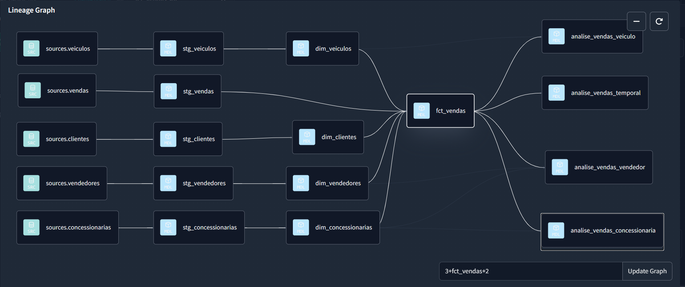
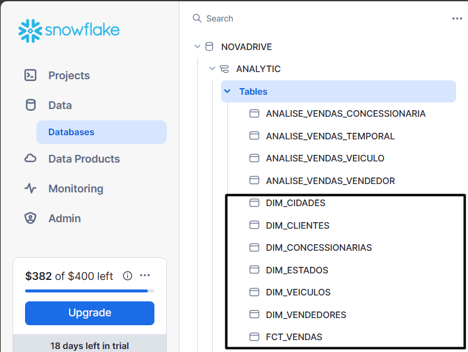

# Projeto de Data Warehouse com Snowflake, DBT, Airflow, PostGreSQL & Looker Studio

Em tal projeto, modelo um **Data Warehouse** no **Snowflake** para às análises de negócio da concessionária fictícia **NovaDrive Motors**, uso o **Apache Airflow** para estruturar uma **DAG** em **Python** que realiza a extração incremental dos dados brutos da concessionária do banco de dados transacional **PostGreSQL** e carrega-os na camada intermediária (**Staging**) do **DWH**, por fim, uso o **DBT**, transformo e trato tais dados brutos em análises que são disponibilizadas na camada analítica do **DWH** para compor o **dashboard** de **BI (Business Intelligence)** no **Looker Studio** para analisar às vendas de tal concessionária.


## Extração:

Basicamente, na primeira fase do projeto, tive que extrair os dados brutos do banco de dados transacional **PostGreSQL** de tais tabelas **vendas**, **vendedores**, **veiculos**, **estados**, **cidades**, **clientes** e **concessionarias** do banco de dados da **NovaDrive Motors**.

Abaixo, é exibido o banco de dados transacional da **NovaDrive Motors** e às respectivas tabelas no **PostGreSQL**:

https://github.com/jv-mendes07/elt_data_warehouse_snowflake/assets/93790271/1dbe6d29-b19a-41ea-86ce-92fee3212284

Para realizar tal extração de dados brutos do banco de dados **PostGreSQL** do sistema transacional (**OLTP**) da concessionária, estruturei uma **DAG** no **Airflow** que extrai e ingere incrementalmente os dados brutos do **PostGreSQL** para a camada intermediária (**Staging**) do **Data Warehouse** no **Snowflake**.

Abaixo, é exibível a **DAG** construída no **Airflow** para realizar a carga incremental dos dados brutos do **PostGreSQL** para o **DWH** no **Snowflake**

https://github.com/jv-mendes07/elt_data_warehouse_snowflake/assets/93790271/01c3ec90-c281-47df-8e7d-e9ea534515b9

Abaixo, é vísivel que os dados brutos foram disponibilizados na camada intermediária do **Data Warehouse** no **Snowflake**:

https://github.com/jv-mendes07/elt_data_warehouse_snowflake/assets/93790271/92338726-e1b8-41db-a302-bf4d4b35225a

## Transformação:

Depois de disponibilizar tais dados brutos de vendas da concessionária **NovaDrive Motors** no **DWH** do **Snowflake**, usei o **DBT** como ferramenta para tratar e transformar tais dados brutos, para retira-los de tal camada intermediária (**Staging**) e coloca-los na camada analítica, em que tais dados estarão agrupados e tratados para disponibilizar análises de negócio que irão compor o **dashboard** de **BI (Business Intelligence)**.

Abaixo, exponho a **Pipeline** da linhagem de dados que foi construída no **DBT** para realizar todas transformações e tratamentos nos dados de vendas da **NovaDrive Motors**:



Com o uso do **DBT**, fiz toda a modelagem dimensional **Star-Schema** do conjunto de dados da **NovaDrive Motors** com a transformação de **tabela-fato** e **tabelas-dimensão** para deixar tais dados adequados o suficiente para compor um **Data Warehouse** que seja suportável para análises de negócio avançadas e tomada de decisão embasada em dados.

Abaixo, está uma foto da **tabela-fato** e das **tabelas-dimensão** que foram transformadas com o **DBT** e disponibilizadas na camada analítica do **Data Warehouse** no **Snowflake**:



Antes de construir o **dashboard** de **BI (Business Intelligence)** das vendas da concessionária **NovaDrive Motors**, fiz mais transformações com o **DBT** para realizar agregações e agrupamentos que irão entregar tais dados adequados e prontos para a análise de negócios aos usuários finais de tal **dashboard**:

**(1)** **Análise de vendas por concessionária**:

Primeiramente, com o **DBT** fiz uma consulta **SQL** que traz a quantidade vendida, o faturamento total e médio por concessionária da **NovaDrive Motors**:

```
{{ config(materialized = 'table')}}
SELECT  
    con.concessionaria_id AS id,
    con.concessionaria,
    cid.nome_cidade AS cidade,
    est.nome_estado AS estado,
    COUNT(v.venda_id) AS quantidade_vendas,
    SUM(v.valor_venda) AS faturamento,
    AVG(v.valor_venda) AS faturamento_medio
FROM
    {{ ref('fct_vendas') }} v
JOIN
    {{ ref('dim_concessionarias')}} con
ON
    v.concessionaria_id = con.concessionaria_id
JOIN
    {{ ref('dim_cidades')}} cid 
ON
    cid.cidade_id = con.cidade_id
JOIN
    {{ ref('dim_estados')}} est
ON 
    est.estado_id = cid.estado_id
GROUP BY
    con.concessionaria_id,
    con.concessionaria,
    cid.nome_cidade,
    est.nome_estado
ORDER BY 
    faturamento DESC
```
**(2)** **Análise de vendas temporal**:

Depois, fiz uma consulta **SQL** que traz a quantidade vendida, o faturamento total e médio por mês da **NovaDrive Motors**:

```
{{ config(materialized = 'table')}}
SELECT  
    DATE_TRUNC('month', v.data_venda) AS mes_venda,
    COUNT(v.venda_id) AS quantidade_vendas,
    SUM(v.valor_venda) AS faturamento,
    AVG(v.valor_venda) AS faturamento_medio
FROM
    {{ ref('fct_vendas') }} v
GROUP BY
    DATE_TRUNC('month', v.data_venda)
ORDER BY 
    mes_venda ASC
```

**(3)** **Análise de vendas por veículo**:

Adicionalmente, fiz mais uma consulta **SQL** que traz a quantidade vendida, o faturamento total e médio por veículo da **NovaDrive Motors**:

```
{{ config(materialized = 'table')}}
SELECT  
    vei.veiculo_id AS id,
    vei.nome_veiculo AS veiculo,
    vei.tipo AS tipo,
    vei.valor_sugerido AS valor_sugerido,
    COUNT(v.venda_id) AS quantidade_vendas,
    SUM(v.valor_venda) AS faturamento,
    AVG(v.valor_venda) AS faturamento_medio
FROM
    {{ ref('fct_vendas') }} v
JOIN
    {{ ref('dim_veiculos')}} vei
ON
    v.veiculo_id = vei.veiculo_id
GROUP BY
    vei.veiculo_id,
    vei.nome_veiculo,
    vei.tipo,
    vei.valor_sugerido
ORDER BY 
    faturamento DESC
```
**(4)** **Análise de vendas por vendedor**:

Por fim, fiz mais uma consulta **SQL** que traz a quantidade vendida, o faturamento total e médio por vendedor de cada concessionária da **NovaDrive Motors**:

```
{{ config(materialized = 'table')}}
SELECT  
    ven.vendedor_id AS id,
    ven.nome_vendedor AS vendedor,
    c.concessionaria AS concessionaria,
    COUNT(v.venda_id) AS quantidade_vendas,
    SUM(v.valor_venda) AS faturamento,
    AVG(v.valor_venda) AS faturamento_medio
FROM
    {{ ref('fct_vendas') }} v
JOIN
    {{ ref('dim_vendedores')}} ven
ON
    v.vendedor_id = ven.vendedor_id
JOIN
    {{ ref('dim_concessionarias')}} c
ON
    c.concessionaria_id = ven.concessionaria_id
GROUP BY
    ven.vendedor_id,
    ven.nome_vendedor,
    c.concessionaria
ORDER BY 
    faturamento DESC
```

## Dashboard de BI (Business Intelligence) de vendas da NovaDrive Motors:

Finalmente, após **(1)** carregar os dados brutos da **NovaDrive Motors** do **PostGreSQL** para a camada intermediária do **DWH** no **Snowflake**, **(2)** realizar todas transformações e tratamentos com **DBT** que retiram tais dados brutos da camada intermediária e os colocam prontos e adequados para a análise de negócios avançada na camada analítica do **DWH**, usei o **(3)** **Looker Studio** como ferramenta de **BI** para construir um **dashboard** de **BI (Business Intelligence)** que forneça métricas, **KPIs** (indicadores) e gráficos que possam transmitir informações que possam ajudar na tomada de decisão empresarial embasada em dados aos gestores e executivos da **NovaDrive Motors**:

https://github.com/jv-mendes07/elt_data_warehouse_snowflake/assets/93790271/42c1003a-00d5-440e-8902-4e0b0ad2e6c7

No **dashboard** de **BI** das vendas da **NovaDrive Motors** é possível filtrar às informações de vendas por estado, concessionária, e também possível visualizar em um **gráfico de mapa** ou **gráfico de barra** quais são os estados brasileiros que mais geram faturamento e vendas para a **NovaDrive Motors**.

## Considerações finais:

Por fim, uma das possíveis melhorias para tal projeto seria **(1)** usar uma ferramenta de **ETL** apropriada para realizar a extração e a carga incremental dos dados brutos do **PostGreSQL** para a camada intermediária do **Data Warehouse** no **Snowflake**, ao invés de usar o **Airflow**, até porque o **Airflow** é uma ferramenta de orquestração e não de ingestão de dados, neste caso, seria viável usar o **Data Factory** para realizar tal carga incremental, e usar somente o **Airflow** para chamar tais **Pipelines incrementais** no **Data Factory** para extrair tais dados brutos da fonte (**PostGreSQL**) e ingeri-los no destino (**Snowflake**).


